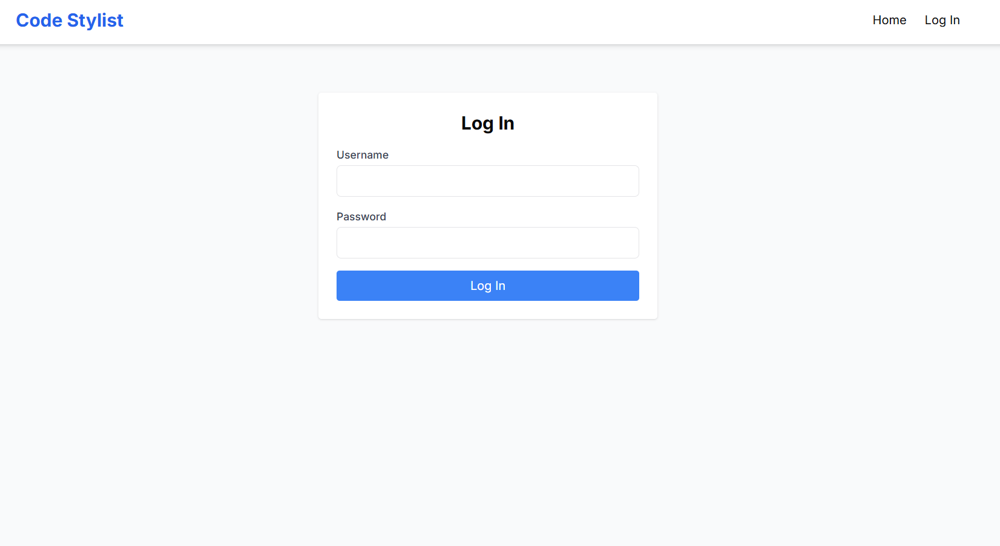
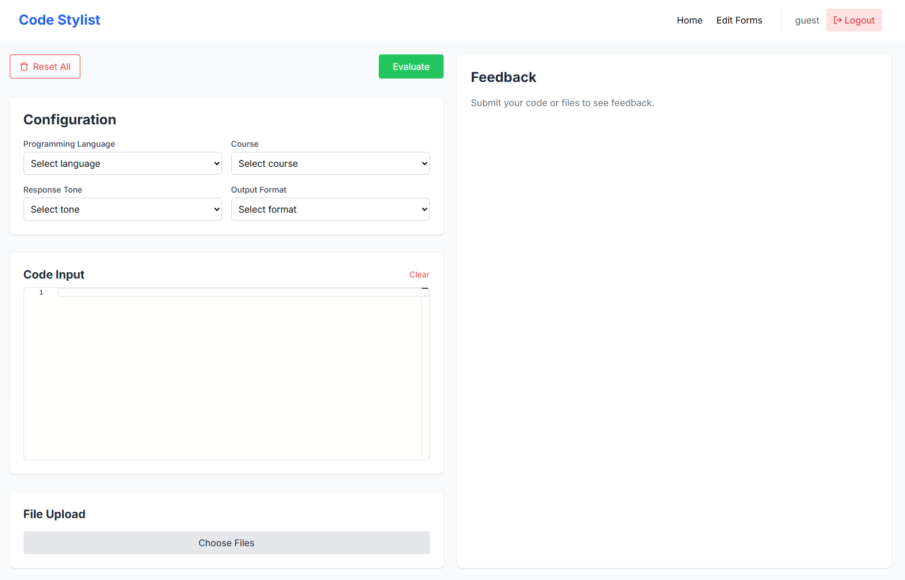

# Code Stylist TA
---

## About
Code style feedback tool for beginner programmers. Meant to help instructors guarantee their students are truly learning their course content and combat students complacency when using Generative Artificial Intelligence for coursework.

## Objectives
To make a tool that can help students improve their coding standards (comments, style, documentation, etc.). This tool is to be used for students to practice and get feedback before and after submission of their tasks. An additional aid for students to be able to submit something better, get more details and clarification on the feedback they can get from this additional point of view, so to speak.

Note that a teacher (assistant) would still be the one giving the final grade. Instructors are also considered as an additional user of this platform, by having an interface through which they can specify details about the course.

---

## Front-end

The front-end for this project was generated with NextJS.

Go to the `/frontend` folder and add `.env.local` with the same format as `.env.example`. Then, install the necessary libraries using `npm install` and once that is done, run `npm run dev` for a dev server. Navigate to `http://localhost:3000/`. The application will automatically reload if you change any of the source files.

## Back-end

Powered by Flask. Create a virtual environment with the [environment.yml](https://github.com/davento/codeStylistTA/blob/main/backend/environment.yml) file. Activate it and install the necessary libraries shown in [requirements.txt](https://github.com/davento/codeStylistTA/blob/main/backend/requirements.txt). After this, in the `/backend` directory, add a file titled `users.csv` adding users in the format shown in `users_csv_example`. Then, run the app using ```flask --app app run --port 5001```.

## Prompt logic
The file `appAssistant.py` contains the prompt logic. The array `messages_to_send` contains each of the messages that make up the prompt. A first message contains all of the "configuration" for the agent to use (role, instructions, response, options), while the following ones contain the code that is to be evaluated split into chunks.

Make sure to fill in your OpenAI API key on line 7 for correct functioning.

## Deployment

> Tl;dr: run `docker compose up -d --build`, ensuring that both the `.env.local` in `/nextjs-frontend` and both `users.csv` and `.env` in `/back` are available and correctly initialized.

We containerized the frontend and backend as separate services using Docker Compose to improve maintainability and deployment consistency. The frontend is exposed on port 5005 and the backend on port 4651, with both services connected through a shared Docker network to enable secure communication. Environment-specific configuration is provided through separate `.env` files, while backend data is persisted through a mounted volume to retain information across deployments.

---

## Folder Overview
```text
📂 /backend
├── 📄 .env
├── 🐳 Dockerfile
├── 📄 app.py
├── 📂 /data                   : CSV user and deployment
├── 📂 /guidelines_files       : markdowns containing coding standards guidelines
└── 📂 /src                    : app, deployment, environment and package related
    ├── 📂 /AIAgent
    │   └── 📄 appAssistant.py : prompt logic
    └── 📂 /unitTests          : app tests

📂 /frontend
├── 📄 .env.example
├── 🐳 Dockerfile
└── 📂 /src
    ├── 📂 /app
    │   ├── 📂 /fonts          : fonts used by the layout
    │   └── 📂 /login          : login layout
    ├── 📂 /components
    │   └── 📂 /ui             : UI-oriented components
    ├── 📂 /context            : session logic
    ├── 📂 /data               : JSON with configuration data
    └── 📂 /lib                : library imports

📂 /screenshots
└── Images of the app used for this README

🐳 docker-compose.yml
```

## How to use the application

After launching the tool, a login interface appears.



Once the user logs in, the main menu shows up. You can select your options on the top left side and pick between either inserting code manually or using an existing file. Clicking green button starts the analysis of the code. The feedback will appear on the right side of the display. The red button restores everything to default settings.



---

## Extra Resources

__**OpenAI API:**__
- [Text Generation](https://platform.openai.com/docs/guides/text-generation)
- [Code Interpreter](https://platform.openai.com/docs/assistants/tools/code-interpreter)

__**Code Standard Guidelines References**__
- [List of Guidelines Used](https://github.com/davento/codeStylistTA/blob/main/backend/guidelines_files/README.md)
